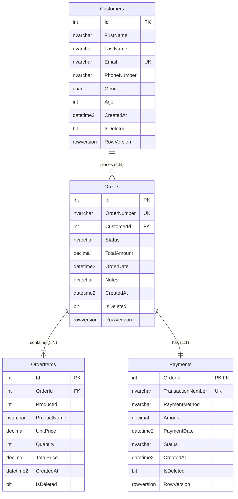

# Craft Bakery Platform — Платформа крафтової пекарні

Навчальний семестровий проєкт із дисципліни **«Технології .NET у веб-інженерії»**.
Викладач: **Томка Ю.Я.** | Студент: **Казімір В.І.** (група 443-2).

---

## 1. Опис предметної області та архітектури

Проєкт являє собою розподілену систему для крафтової пекарні **«Craft Bakery»**, що забезпечує автоматизацію прийому онлайн-замовлень свіжої випічки, управління асортиментом та технологічними картами (рецептурою), а також збір і модерацію відгуків покупців.

Система спроєктована на базі патерну **Database-per-Service** і розділена на три незалежні контексти:
1. **Orders Context (Замовлення та клієнти):** реляційна БД `BakeryOrdersDB` (SQL Server, доступ через чистий ADO.NET та Dapper).
2. **Catalog Context (Каталог та рецептура):** реляційна БД `BakeryCatalogDB` (SQL Server, доступ через Entity Framework Core).
3. **Reviews Context (Відгуки покупців):** документоорієнтована NoSQL БД `BakeryReviewsDB` (MongoDB).

> [!IMPORTANT]
> Між базами даних **відсутні фізичні зв'язки FOREIGN KEY**. Усі міжсервісні посилання здійснюються за числовими ідентифікаторами (`Id`), що гарантує повну незалежність розгортання та автономність кожного мікросервісу.

---

## 2. Політика дублювання даних між базами (Data Duplication Policy)

| Поле / Дані | База-власник (Master) | Де дублюється (Replica) | Мета дублювання | Механізм підтримки узгодженості |
|---|---|---|---|---|
| `UnitPrice` (Ціна товару) | `BakeryCatalogDB.Products` | `BakeryOrdersDB.OrderItems` | Фіксація суми покупки: зміна ціни в каталозі не впливає на старі чеки | **Знімок (Snapshot):** копіюється в момент створення замовлення |
| `ProductName` (Назва товару) | `BakeryCatalogDB.Products` | `BakeryOrdersDB.OrderItems` | Автономність друку чеків та звітів без мережевих запитів до каталогу | **Знімок (Snapshot):** копіюється в момент покупки |
| `ProductName` (Назва товару) | `BakeryCatalogDB.Products` | `BakeryReviewsDB.reviews` | Швидка видача списку відгуків клієнту без міжсервісних Join | **Подієва узгодженість (Eventual Consistency):** подія `ProductRenamedEvent` |
| `CustomerName` (Ім'я клієнта) | `BakeryOrdersDB.Customers` | `BakeryReviewsDB.reviews` | Відображення автора відгуку без звернення до бази клієнтів | **Подієва узгодженість (Eventual Consistency):** подія `CustomerProfileUpdatedEvent` |

---

## 3. Діаграма сутностей (ERD) Проєкту №1 (Orders)



---

## 4. Інструкція з розгортання баз даних

Скрипти баз даних згруповані у каталозі `db/`:
```text
db/
├── p1/    # Проєкт №1 (Orders): schema.sql · procedures.sql · seed.sql
├── p2/    # Проєкт №2 (Catalog): schema.sql · seed.sql
└── p3/    # Проєкт №3 (MongoDB): collections.js · seed.js
```

### Порядок виконання для SQL Server:
1. **Проєкт №1 (BakeryOrdersDB):**
   ```sql
   -- 1. Створення таблиць, зв'язків 1:1, 1:N, M:N та індексів
   :r db/p1/schema.sql
   -- 2. Створення збережуваних процедур (транзакційна зміна статусу, CRUD)
   :r db/p1/procedures.sql
   -- 3. Ідемпотентне наповнення тестовими даними (IF NOT EXISTS)
   :r db/p1/seed.sql
   ```
2. **Проєкт №2 (BakeryCatalogDB):**
   ```sql
   -- 1. Створення каталогу та зв'язку M:N з полем AmountGram
   :r db/p2/schema.sql
   -- 2. Ідемпотентний seed товарів та інгредієнтів
   :r db/p2/seed.sql
   ```

### Порядок виконання для MongoDB:
3. **Проєкт №3 (BakeryReviewsDB):**
   ```bash
   # Ініціалізація валідації колекцій
   mongosh BakeryReviewsDB db/p3/collections.js
   # Наповнення тестовими відгуками
   mongosh BakeryReviewsDB db/p3/seed.js
   ```

